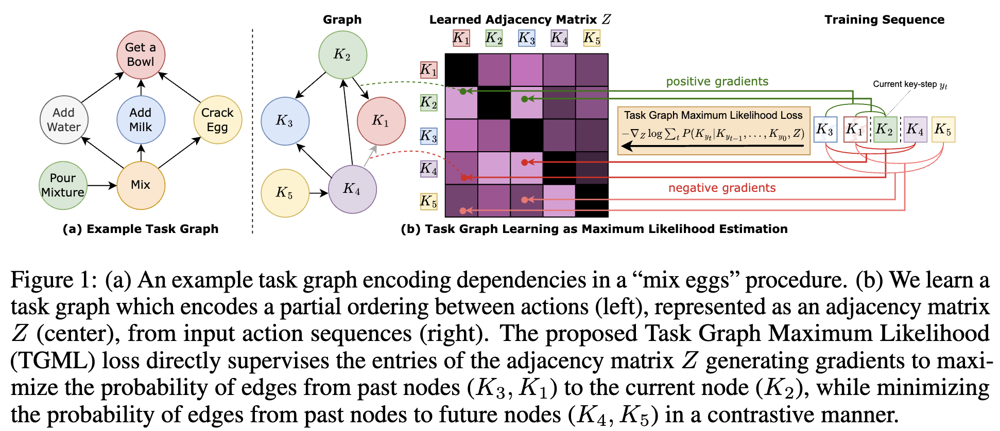
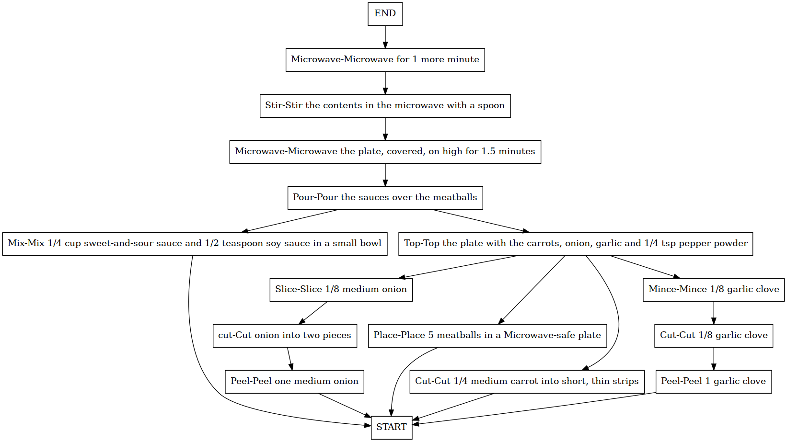
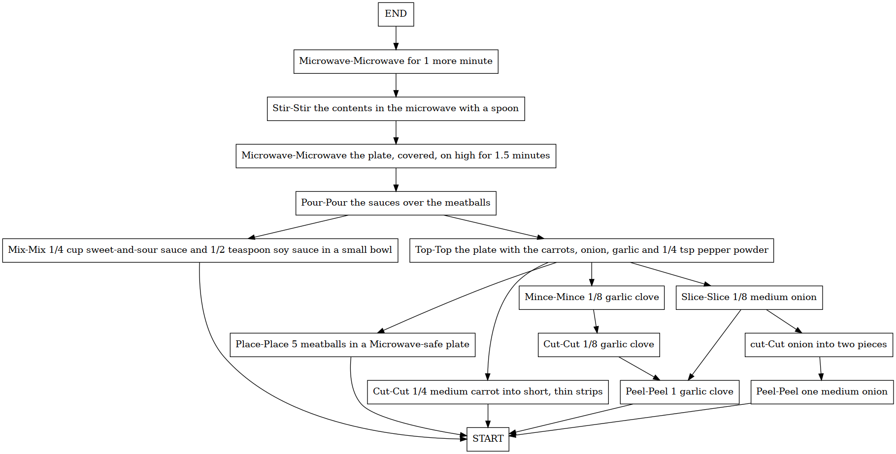

# Differentiable Task Graph Learning

Here we report the guide to use our Direct Optimization (DO) model and train it in our defined CaptainCook4D data split for generating task graphs.

---
- [Environment configuration](#environment-configuration)
- [Data](#data)
- [Training](#training)
- [Qualitative results](#qualitative-results)
- [Get DO results of Table 1 of the paper](#get-do-results-of-table-1-of-the-paper)
- [Citation](#citation)
---

<p align="center">
  
</p>


## Environment configuration

The code was tested with Python 3.9. Run the following commands to configurate a new conda environment:

```shell
conda create -n tgml python=3.9
conda activate tgml
python -m pip install -e ./lib
conda install -c conda-forge pygraphviz
```

The specified versions of PyTorch and its associated libraries are recommended for optimal compatibility and performance:

- **PyTorch:** 2.0.1
- **Torchvision:** 0.15.2
- **Torchaudio:** 2.0.2
- **PyTorch with CUDA:** Version 11.7

These packages can be installed using the following command:
```bash
conda install pytorch==2.0.1 torchvision==0.15.2 torchaudio==2.0.2 pytorch-cuda=11.7 -c pytorch -c nvidia
```

While these versions are recommended, newer versions of these libraries may also be compatible with the project. If you choose to use alternative versions, please ensure they do not introduce any compatibility issues. 


## Data
In the **./data** directory, you will find the CaptainCook4D data that we have defined for our task. This data is provided in compliance with the license defined by the original authors. Our split differs from those defined by the original authors of the paper, as we have only included annotations from the training and validation set videos that do not contain errors. For more information about the original dataset, please visit the official [CaptainCook4D repository](https://github.com/CaptainCook4D/).


## Training

To generate a single task graph, run:
```shell
python train.py -cfg ./configs/CaptainCook4D/Ramen.yaml

Usage: train.py [OPTIONS]

Options:
  -cfg, --config TEXT  Path to the config file. You can find the config file
                       in the config folder.  [required]
  -l, --log            Log the output to a file.
  -s, --seed INTEGER   Seed for reproducibility.
  --help               Show this message and exit.
```

To generate all task graphs, run:
```shell
python train_all.py --more_seeds

Usage: train_all.py [OPTIONS]

Options:
  --more_seeds  Use multiple seeds for error bars.
  --help        Show this message and exit.
```


## Qualitative results
The figure reports the generated task graphs of the procedure called "Dressed Up Meatballs". On the left there is the ground truth task graph, while on the right the generated using the Direct Optimization model. These graphs must be interpreted from the bottom up, reflecting the bottom-up nature of dependency edges.

Ground Truth             |  Generated 
:-------------------------:|:-------------------------:
 | 


## Get DO results of Table 1 of the paper
Run the following command after `python train_all.py --more_seeds`:
```shell
python captaincook4d_results.py
```

## Citation

...
