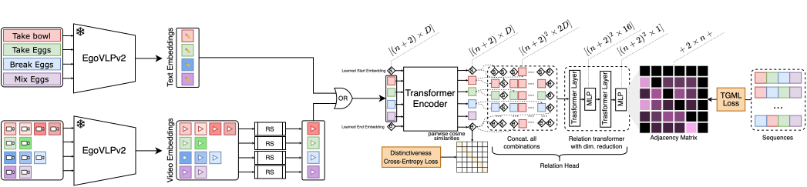

# Differentiable Task Graph Learning: Procedural Activity Representation and Online Mistake Detection from Egocentric Videos

[Differentiable Task Graph Learning: Procedural Activity Representation and Online Mistake Detection from Egocentric Videos](https://arxiv.org/abs/2406.01486)

[Luigi Seminara](https://seminaraluigi.altervista.org/), [Giovanni Maria Farinella](https://www.dmi.unict.it/farinella/), [Antonino Furnari](https://antoninofurnari.github.io/)

NeurIPS (spotlight), 2024

[arXiv pre-print](https://arxiv.org/pdf/2406.01486v1)


## 📢 News
- [September, 2024] *Differentiable Task Graph Learning* is accepted in **NeurIPS 2024** as <u>spotlight</u>.


## ✍️ Catalog
🚧 WORK IN PROGRESS:
- [x] Baselines
- [x] Direct Optimization (DO) Model
- [x] Task Graph Transformer (TGT) Model
- [x] Video Understanding
- [ ] Online Mistake Detection
- [ ] Guide for all experiments

---
- [Repository Structure](#repository-structure)
- [Environment configuration](#environment-configuration)
- [Data and format](#data-and-format)
- [Qualitative results](#qualitative-results)
- [Contact](#contact)
- [Acknowledgements](#acknowledgements)
- [Citation](#citation)
- [Authors](#authors)
---

<p align="center">
  
</p>

<p align="center">
  
</p>

## Repository Structure
```text
Differentiable-Task-Graph-Learning
├── assets
├── configs
│   ├── Baselines
│   ├── CaptainCook4D-DO
│   └── CaptainCook4D-TGT-text
├── data
│   ├── assembly101
│   ├── captaincook4d
│   │   └── ground_truth_task_graphs
│   └── epic-tent
├── lib
└── task-graph-learning
    ├── DO
    ├── TGT
    ├── baselines
    ├── utils
    └── video_understanding

```
- ``assets/``: This folder contains static resources such as images, logos, or visualizations used in the project (for presentations or documentation purposes).
- ``configs/``: This directory contains various configuration files, divided into subcategories:
  - ``Baseline/``: Configurations for baseline methods.
  - ``CaptainCook4D-DO/``: Configuration files for using CaptainCook4D datasets with the Direct Optimization (DO) model.
  - ``CaptainCook4D-TGT-text/``: Configuration files for using CaptainCook4D dataset with the Task Graph Transformer (TGT) model based on text embeddings.
- ``data/``: Houses the datasets used in the project.
  - ``assembly101/``: A subdirectory dedicated to the Assembly101-O dataset.
  - ``captaincook4d/``: A subdirectory dedicated to the CaptainCook4D dataset.
    - ``ground_truth_task_graphs/``: Contains ground truth task graphs.
  - ``epic-tent/``: A subdirectory dedicated to the EPIC-Tent-O dataset.
- ``lib/``: Contains external libraries, utilities, and custom modules that the project depends on for task graph learning.
- ``task-graph-learning/``: Contains all the scripts for task graph learning.
  - ``DO/``: Contains the scripts to use the Direct Optimization (DO) method for task graph learning.
  - ``online-mistake-detection``: Contains the scripts for online mistake detection experiments.
  - ``TGT/``: Contains the scripts to use the Task Graph Transformer (TGT) approach for task graph learning.
  - ``baselines/``: Contains the scripts to use the baselines for task graph generation.
  - ``utils/``: Contains scripts for evaluation.
  - ``video_understanding/``: Contains scripts for video understanding experiments.

## Environment configuration

The code was tested with Python 3.9. Run the following commands to configurate a new conda environment:

```shell
conda create -n tgml python=3.9
conda activate tgml
python -m pip install -e ./lib
conda install -c conda-forge pygraphviz
```

The specified versions of PyTorch and its associated libraries are recommended for optimal compatibility and performance:

- **PyTorch:** 2.0.1
- **Torchvision:** 0.15.2
- **Torchaudio:** 2.0.2
- **PyTorch with CUDA:** Version 11.7

These packages can be installed using the following command:
```bash
conda install pytorch==2.0.1 torchvision==0.15.2 torchaudio==2.0.2 pytorch-cuda=11.7 -c pytorch -c nvidia
```

While these versions are recommended, newer versions of these libraries may also be compatible with the project. If you choose to use alternative versions, please ensure they do not introduce any compatibility issues. 


## Data and format
In the **./data** directory, you will find the CaptainCook4D data that we have defined for our task. This data is provided in compliance with the license defined by the original authors. Our split differs from those defined by the original authors of the paper, as we have only included annotations that do not contain errors. For more information about the original dataset, please visit the official [CaptainCook4D repository](https://github.com/CaptainCook4D/).

The proposed methods can be used with other datasets that follow the following JSON structure:

```JSON
{
    "annotations": {
        "1_14": {  // Unique identifier for a specific recording session [MANDATORY]
            "recording_id": "1_14",  // Identifier for the recording (e.g., video file) [OPTIONAL]
            "activity_id": 1,  // Numeric ID of the activity being performed [OPTIONAL]
            "activity_name": "Microwave Egg Sandwich",  // Name of the activity being performed [MANDATORY]
            "person_id": 1,  // ID of the person performing the task [OPTIONAL]
            "environment": 5,  // Numeric code representing the environment (e.g., kitchen type) [OPTIONAL]
            "scenario": "microwaveeggsandwich",  // Scenario name as a string (used for taxonomy linking) [MANDATORY]
            "segments": [
                {
                    "step_id": 12,  // Step number within the activity [MANDATORY]
                    "start_time": 0.799,  // Start time of the segment (in seconds) [MANDATORY]
                    "end_time": 87.74,  // End time of the segment (in seconds) [MANDATORY]
                    "description": "Cut - Cut the English muffin into two pieces with a knife",  // Text description of the action being performed [MANDATORY]
                    "has_errors": false,  // Boolean flag indicating whether this segment contains any errors [OPTIONAL]
                    "step_name": "Cut - Cut the English muffin into two pieces with a knife"  // Name of the action or step being performed [MANDATORY]
                },
              ...
            ]
          }
      ...
    },
    "taxonomy": {
        "microwaveeggsandwich": {  // Category or task label for the scenario
            "1": { // This is the same of the "id"
                "name": "Pour - Pour 1 egg into the ramekin cup",  // Name of the step in the taxonomy [MANDATORY]
                "id": 1,  // Unique ID of this step [MANDATORY]
                "is_leafnode": true,  // Boolean flag indicating if this step is a leaf node (i.e., has no substeps) [OPTIONAL]
                "parent_id": null,  // ID of the parent step (null if no parent) [OPTIONAL]
                "parent_name": null  // Name of the parent step (null if no parent) [OPTIONAL]
            },
          ...
        }
    }
}
```

***NOTE: Fields marked <u>MANDATORY</u> are required for the proposed methods to work, while fields marked <u>OPTIONAL</u> can be absent without affecting the functionality of the code.***

## Qualitative results
The figure reports the generated task graphs of the procedure called "Dressed Up Meatballs". On the left there is the ground truth task graph, while on the right the generated using the Direct Optimization model. These graphs must be interpreted from the bottom up, reflecting the bottom-up nature of dependency edges.

Ground Truth             |  Generated 
:-------------------------:|:-------------------------:
 | 


## Contact
This repository is created and maintained by [Luigi](https://seminaraluigi.altervista.org/). Technical questions and discussions are encouraged via [GitHub issues](https://github.com/fpv-iplab/Differentiable-Task-Graph-Learning/issues), as this allows everyone interested in the work to benefit from the shared information. However, you can always reach us directly via <a href="mailto:luigi.seminara@phd.unict.it?subject=Inquiry about your paper Differentiable Task Graph Learning&cc=antonino.furnari@unict.it;giovanni.farinella@unict.it">email</a>.


## Acknowledgements
This research is supported in part by the PNRR PhD scholarship "Digital Innovation: Models, Systems and Applications" DM 118/2023, by the project Future Artificial Intelligence Research (FAIR) – PNRR MUR Cod. PE0000013 - CUP: E63C22001940006, and by the Research Program PIAno di inCEntivi per la Ricerca di Ateneo 2020/2022 — Linea di Intervento 3 "Starting Grant" EVIPORES Project - University of Catania.

We thank the authors of [PREGO](https://github.com/aleflabo/PREGO) and in particular [Alessandro Flaborea](https://github.com/aleflabo) and [Guido Maria D'Amely di Melendugno](https://github.com/GDam90) for sharing the code to replicate experiments in the PREGO benchmark.

Visit [PREGO repository](https://github.com/aleflabo/PREGO) for more details.


## Citation
If you use the code/models hosted in this repository, please cite the following paper:

```text
@article{seminara2024differentiable,
  title={Differentiable Task Graph Learning: Procedural Activity Representation and Online Mistake Detection from Egocentric Videos},
  author={Seminara, Luigi and Farinella, Giovanni Maria and Furnari, Antonino},
  journal={arXiv preprint arXiv:2406.01486},
  year={2024}
}
```
Please, refer to the [paper](https://arxiv.org/pdf/2406.01486v1) for more technical details.


## Authors


