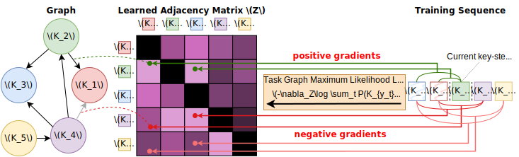
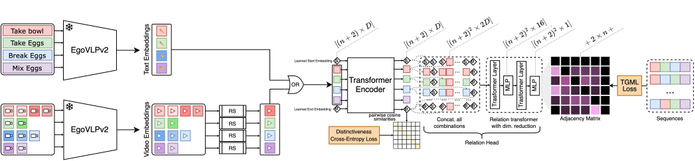

# Experiments

<u>*Remember to configure the environment*</u>. [[LINK](https://github.com/fpv-iplab/Differentiable-Task-Graph-Learning#environment-configuration)]

Here is a guide on how to perform the experiments described in the paper. All the steps will be outlined in detail, including a comprehensive description of every parameter that the script or configuration file takes as input.

Download everything you need to run the experiments:

| CaptainCook4D text features                                  | CaptainCook4D video features                                 | Assembly101 text features                                    | EPIC-Tent text features                                      |
| ------------------------------------------------------------ | ------------------------------------------------------------ | ------------------------------------------------------------ | ------------------------------------------------------------ |
| [](https://iplab.dmi.unict.it/sharing/Differentiable_Task_Graph_Learning/captaincook4d/text_feature.zip) | [](https://iplab.dmi.unict.it/sharing/Differentiable_Task_Graph_Learning/captaincook4d/video_and_text_feature.zip) | [](https://iplab.dmi.unict.it/sharing/Differentiable_Task_Graph_Learning/assembly101/text_feature.zip) | [](https://iplab.dmi.unict.it/sharing/Differentiable_Task_Graph_Learning/epic-tent/text_feature.zip) |
| **NOTE**: Unzip and move the folder **/text_feature/** inside the folder **../data/captaincook4d** | **NOTE**: Unzip and move the folder **./video_and_text_feature/** inside the folder **../data/captaincook4d** | **NOTE**: Unzip and move the folder **/text_feature/** inside the folder **../data/assembly101** | **NOTE**: Unzip and move the folder **./text_feature/** inside the folder **../data/assembly101** |


## Baselines

This section provides a guide for executing the baselines. All baseline results are reproducible, except for those based on **ChatGPT**, which do not have a fixed seed, meaning that executions may yield different results from those presented in the paper.

First of all, change directory:
```shell
cd baselines
```

To run a baseline (different from the LLM one), you can use the script `run_baseline.py`, which takes a configuration file as input, structured as follows:

```yaml
DATA:
  KEYSTEPS_JSON_PATH: ../../data/captaincook4d/task_graph_generation_annotations.json
  OUTPUT_PATH: ./Baseline_ILP_acc
  SCRIPT_PATH: ILP.py
  OBJECTIVE: acc # [OPTIONAL]
```

- **KEYSTEPS_JSON_PATH**: This represents the path to the JSON file containing the dataset for task graph generation.
- **OUTPUT_PATH**: This is the output path where the results will be saved.
- **SCRIPT_PATH**: This refers to the baseline script you wish to execute. The repository includes `ILP.py` and `count_based.py`.
- **OBJECTIVE**: This is optional and should only be specified when using the script `ILP.py`. See details below.

### MSGI 

> Sohn, Sungryull, et al. "Meta reinforcement learning with autonomous inference of subtask dependencies." arXiv preprint arXiv:2001.00248 (2020).

To execute the MSGI baseline for all scenarios in CaptainCook4D, you can use the following command:

```shell
python run_baseline.py -cfg ../../configs/Baselines/baseline_ILP_acc.yaml
```

For few-shot experiments, such as the 5-shots described in the paper, you can use the following command:

```shell
python run_baseline.py -cfg ../../configs/Baselines/baseline_ILP_acc_few.yaml
```

This configuration file will also include the `MAX_LENGTH` field, along with the aforementioned parameters, which specifies the number of sequences to consider for constructing the graph.

To obtain the graphs for Assembly101-O and EPIC-Tent-O, you need to execute the following commands:
```shell
python run_baseline.py -cfg ../../configs/Assembly101-O/ILP_acc.yaml
```
```shell
python run_baseline.py -cfg ../../configs/EPIC-Tent-O/ILP_acc.yaml
```

### MSG<sup>2</sup>

> Jang, Yunseok, et al. "Multimodal subtask graph generation from instructional videos." arXiv preprint arXiv:2302.08672 (2023).

To execute the MSG<sup>2</sup> baseline for all scenarios in CaptainCook4D, you can use the following command:

```shell
python run_baseline.py -cfg ../../configs/Baselines/baseline_ILP_prec.yaml
```

For few-shot experiments, such as the 5-shots described in the paper, you can use the following command:

```shell
python run_baseline.py -cfg ../../configs/Baselines/baseline_ILP_prec_few.yaml
```

This configuration file will also include the `MAX_LENGTH` field, along with the aforementioned parameters, which specifies the number of sequences to consider for constructing the graph.

To obtain the graphs for Assembly101-O and EPIC-Tent-O, you need to execute the following commands:
```shell
python run_baseline.py -cfg ../../configs/Assembly101-O/ILP_prec.yaml
```
```shell
python run_baseline.py -cfg ../../configs/EPIC-Tent-O/ILP_prec.yaml
```

### Count-Based

> Ashutosh, Kumar, et al. "Video-mined task graphs for keystep recognition in instructional videos." Advances in Neural Information Processing Systems 36 (2024).

To execute the Count-Based baseline for all scenarios in CaptainCook4D, you can use the following command:

```shell
python run_baseline.py -cfg ../../configs/Baselines/baseline_Count_Based.yaml
```

For few-shot experiments, such as the 5-shots described in the paper, you can use the following command:

```shell
python run_baseline.py -cfg ../../configs/Baselines/baseline_Count_Based_few.yaml
```

This configuration file will also include the `MAX_LENGTH` field, along with the aforementioned parameters, which specifies the number of sequences to consider for constructing the graph.

To obtain the graphs for Assembly101-O and EPIC-Tent-O, you need to execute the following commands:
```shell
python run_baseline.py -cfg ../../configs/Assembly101-O/Count_Based.yaml
```
```shell
python run_baseline.py -cfg ../../configs/EPIC-Tent-O/Count_Based.yaml
```

### LLM
Below is the prompt that was employed to instruct the model on its task, which involves identifying pre-conditions for given procedural steps.

<blockquote>
I would like you to learn to answer questions by telling me the steps 
that need to be performed before a given one.

The questions refer to procedural activities and these are of the following type:

Q - Which of the following key steps is a pre-condition for the current key step 
"add brownie mix"?

- add oil
- add water
- break eggs
- mix all the contents
- mix eggs
- pour the mixture in the tray
- spray oil on the tray
- None of the above

Your task is to use your immense knowledge and your immense ability to tell me 
which preconditions are among those listed that must necessarily be carried out 
before the key step indicated in quotes in the question.

You have to give me the answers and a very brief explanation of why you chose them.

Provide the correct preconditions answer inside a JSON format like this:

{
   "add brownie mix": ["add oil", "add water", "break eggs"]
}
</blockquote>

Finally, we used all the JSON files containing the preconditions to construct the task graphs.

Due to the non-reproducibility of this experiment, the generated graphs have been included in the **./baselines/Baseline_LLM** folder. However, by repeating the experiment, it is still possible to obtain similar results.

### Graph Evaluation for Baselines

To evaluate the predicted task graphs against the ground truth, you can use the following command:

```shell
python evaluation.py -cfg <path to the config file>
```

The configuration file should be defined as follows:

```yaml
DATA:
  ANNOTATIONS: ../../data/captaincook4d/task_graph_generation_annotations.json
  GT_TASK_GRAPHS: ../../data/captaincook4d/ground_truth_task_graphs
  PRED_TASK_GRAPHS: ./Baseline_Count_Based
  OUTPUT_PATH: ./Baseline_Count_Based/evaluation
```

- **ANNOTATIONS**: This represents the path to the JSON file containing annotations, the same file used for task graph generation.
- **GT_TASK_GRAPHS**: This is the path to the folder containing the ground truth task graphs.
- **PRED_TASK_GRAPHS**: This is the path to the folder containing the predicted task graphs.
- **OUTPUT_PATH**: The directory where the evaluation results will be saved.


### Calculating Results

To compute the values reported in the paper, you can use the `calculate_results.py` script, located in the **./utils** folder, as follows:

```shell
python calculate_results.py -r <path to the folder containing evaluations>
```

If you have followed all the previous steps, you will find the evaluation results in the following directories:
- `./baselines/Baseline_Count_Based/evaluation`
- `./baselines/Baseline_ILP_acc/evaluation`
- `./baselines/Baseline_ILP_prec/evaluation`
- `./baselines/Baseline_LLM/evaluation`

## Direct Optimization (DO)
This section provides a guide for using the Direct Optimization (DO) method.

<p align="center">

</p>

First of all, change directory:
```shell
cd DO
```

There are two scripts available for applying the Direct Optimization method: `train_with_gt.py` and `train_without_gt.py`.

### Script `train_with_gt.py`

The script `train_with_gt.py` has the following options:

```text
-cfg, --config TEXT   Path to the config file. You can find the config file in the config folder.  [required]
-l, --log             Log the output to a file.
-s, --seed INTEGER    Seed for reproducibility.
-d, --device TEXT     Device to use for training.
```

The configuration file must contain the following fields:

```yaml
TRAIN:
  ANNOTATIONS: "../../data/captaincook4d/task_graph_generation_annotations.json"
  TASK_GRAPHS: "../../data/captaincook4d/ground_truth_task_graphs"
  ACTIVITY_NAME: "Blender Banana Pancakes"
  OUTPUT_DIR: "./Experiments-DO-model"
  SEED: 42
  BETA: 0.005
  EPOCHS: 1000
```

- **ANNOTATIONS**: Path to the JSON file containing annotations.
- **TASK_GRAPHS**: Path to the folder containing ground truth task graphs.
- **ACTIVITY_NAME**: Name of the activity for which the task graph should be generated.
- **OUTPUT_DIR**: Directory where the output will be saved.
- **SEED**: Seed for reproducibility.
- **BETA**: Hyperparameter.
- **EPOCHS**: Number of epochs.

### Script `train_without_gt.py`

The script `train_without_gt.py` has the following options:

```text
-cfg, --config TEXT   Path to the config file. You can find the config file in the config folder.  [required]
-l, --log             Log the output to a file.
-s, --seed INTEGER    Seed for reproducibility.
-ag, --augmentation   Augmentation of the sequences.
-d, --device TEXT     Device to use for training.
-r, --relaxed         Relaxed edges for graph training.
```

The configuration file must contain the following fields:

```yaml
TRAIN:
  ANNOTATIONS: "../../data/assembly101/train.json"
  ACTIVITY_NAME: "assembly101"
  OUTPUT_DIR: "./Experiments-Assembly101-O/DO-without-early-stopping"
  OUTPUT_NAME: "model_assembly101_final-no-early-stopping.pth"
  SEED: 42
  BETA: 0.005
  EPOCHS: 1200
  MASK: null
  EARLY_STOPPING: null
```
- **ANNOTATIONS**: Path to the JSON file containing annotations.
- **ACTIVITY_NAME**: Name of the activity for which the task graph should be generated.
- **OUTPUT_DIR**: Directory where the output will be saved.
- **OUTPUT_NAME**: Name of the model file.
- **SEED**: Seed for reproducibility.
- **BETA**: Hyperparameter.
- **EPOCHS**: Number of epochs.
- **MASK**: Specifies the nodes to mask during training. A value of `null` indicates no mask is defined.
- **EARLY_STOPPING**: Specifies a value for early stopping. A value of `null` means the training will continue until the number of epochs is reached.


### Training on CaptainCook4D using DO
To perform training on all scenarios of CaptainCook4D using the Direct Optimization (DO) method, use the following command:

```shell
python train_all.py
```

By specifying the `--more_seeds` parameter, you can repeat the experiment with different seed values.

### Calculating Results

To compute the values reported in the paper, you can use the `calculate_results_and_confidence_interval.py` script, located in the **./utils** folder, as follows:

```shell
python calculate_results_and_confidence_interval.py -r <path to the folder containing evaluations>
```

If you used the ``train_all.py`` you will find the results in **./DO/Experiments-DO-model**.

## Task Graph Transformer (TGT)
This section provides a guide for using the Task Graph Transformer (TGT) to generate task graph.

<p align="center">

</p>

First of all, change directory:
```shell
cd TGT
```

There are four scripts to train models to generate task graphs:
- ``train_with_gt_text_single.py``
- ``train_without_gt.py``
- ``train_with_gt_videos.py``
- ``train_with_gt_text_unified.py``

### Script ``train_with_gt_text_single.py``

The script `train_with_gt_text_single.py` has the following options:

```text
-cfg, --config TEXT  Path to the config file. You can find the config file in the config folder.  [required]
--pre_trained TEXT   Path to the pre-trained model.
-l, --log            Log the output in a file.
-s, --seed INTEGER   Seed for reproducibility.
--cuda INTEGER       CUDA device to use.
-w                   Use wandb.
--project_name TEXT  Project name for wandb.
--entity TEXT        Entity name for wandb.
--save               Save the model.
```

The configuration file must contain the following fields:

```yaml
TRAIN:
  ANNOTATIONS: "../../data/captaincook4d/task_graph_generation_annotations.json"
  TASK_GRAPHS: "../../data/captaincook4d/ground_truth_task_graphs"
  ACTIVITY_NAME: "Blender Banana Pancakes"
  OUTPUT_DIR: "./Experiments-TGT-text-model"
  SEED: 42
  EPOCHS: 3000
  EMBEDDINGS: "../../data/captaincook4d/text_feature"
```

- **ANNOTATIONS**: Path to the JSON file containing annotations.
- **TASK_GRAPHS**: Path to the folder containing ground truth task graphs.
- **ACTIVITY_NAME**: Name of the activity for which the task graph should be generated.
- **OUTPUT_DIR**: Directory where the output will be saved.
- **SEED**: Seed for reproducibility.
- **EPOCHS**: Number of epochs.
- **EMBEDDINGS**: Path to the text embeddings.


### Script ``train_without_gt.py``

The script ``train_without_gt.py`` has the following options:

```text
-cfg, --config TEXT  Path to the config file. You can find the config file in the config folder.  [required]
-l, --log            Log the output to a file.
-s, --seed INTEGER   Seed for reproducibility.
-ag, --augmentation  Augmentation of the sequences.
-d, --device TEXT    Device to use.
-r, --relaxed        Relaxed edges.
```

The configuration file must contain the following fields:

```yaml
TRAIN:
  ANNOTATIONS: "../../data/assembly101/train.json"
  ACTIVITY_NAME: "assembly101"
  OUTPUT_DIR: "./Experiments-Assembly101-O/TGT"
  SEED: 42
  BETA: 1.0
  EPOCHS: 1200
  EMBEDDINGS: "../../data/assembly101/text_feature"
  MASK: "5, 6, 7, 10, 11, 16, 17, 22, 23, 24, 27, 30, 34, 35, 36, 41, 46, 47, 50, 51, 52, 53, 66, 70, 71, 78, 85"
  LR: 0.000001
```

- **ANNOTATIONS**: Path to the JSON file containing annotations.
- **ACTIVITY_NAME**: Name of the activity for which the task graph should be generated.
- **OUTPUT_DIR**: Directory where the output will be saved.
- **SEED**: Seed for reproducibility.
- **BETA**: Hyperparameter.
- **EPOCHS**: Number of epochs.
- **EMBEDDINGS**: Path to the text embeddings.
- **MASK**: Specifies the nodes to mask during training. A value of `null` indicates no mask is defined.
- **LR**: Learning rate.

### Script ``train_with_gt_videos.py``

The script ``train_with_gt_videos.py`` has the following options:

```text
-cfg, --config TEXT  Path to the config file. You can find the config file in the config folder.  [required]
-l, --log            Log the output in a file.
-s, --seed INTEGER   Seed for reproducibility.
--cuda INTEGER       CUDA device to use.
-w                   Use wandb.
--project_name TEXT  Project name for wandb.
--entity TEXT        Entity name for wandb.
--save               Save the model.
```

The configuration file must contain the following fields:

```yaml
TRAIN:
  ANNOTATIONS: "../../data/captaincook4d/task_graph_generation_annotations.json"
  TASK_GRAPHS: "../../data/captaincook4d/ground_truth_task_graphs"
  ACTIVITY_NAME: "Blender Banana Pancakes"
  OUTPUT_DIR: "./Experiments-TGT-video-model"
  SEED: 42
  EPOCHS: 3000
  EMBEDDINGS: "../../data/captaincook4d/video_and_text_feature"
```

- **ANNOTATIONS**: Path to the JSON file containing annotations.
- **TASK_GRAPHS**: Path to the folder containing ground truth task graphs.
- **ACTIVITY_NAME**: Name of the activity for which the task graph should be generated.
- **OUTPUT_DIR**: Directory where the output will be saved.
- **SEED**: Seed for reproducibility.
- **EPOCHS**: Number of epochs.
- **EMBEDDINGS**: Path to the video embeddings.

### Script ``train_with_gt_text_unified.py``

The script ``train_with_gt_text_unified.py`` has the following options:

```text
-cfg, --config TEXT  Path to the config file. You can find the config file in the config folder.  [required]
-l, --log            Log the output in a file.
-s, --seed INTEGER   Seed for reproducibility.
--cuda INTEGER       CUDA device to use.
-w                   Use wandb.
--project_name TEXT  Project name for wandb.
--entity TEXT        Entity name for wandb.
--exclude_current    Exclude the current config task graph. Use for leave one out.
```

The configuration file must contain the following fields:

```yaml
TRAIN:
  ANNOTATIONS: "../../data/captaincook4d/task_graph_generation_annotations.json"
  TASK_GRAPHS: "../../data/captaincook4d/ground_truth_task_graphs"
  ACTIVITY_NAME: "Blender Banana Pancakes"
  OUTPUT_DIR: "./Experiments-TGT-text-model"
  SEED: 42
  EPOCHS: 3000
  EMBEDDINGS: "../../data/captaincook4d/text_feature"
```

- **ANNOTATIONS**: Path to the JSON file containing annotations.
- **TASK_GRAPHS**: Path to the folder containing ground truth task graphs.
- **ACTIVITY_NAME**: Name of the activity for which the task graph should be generated.
- **OUTPUT_DIR**: Directory where the output will be saved.
- **SEED**: Seed for reproducibility.
- **EPOCHS**: Number of epochs.
- **EMBEDDINGS**: Path to the text embeddings.

If you use the option ``--exclude-current``, the ``ACTIVITY_NAME`` will be excluded from the training. This option was used to train models excluding one scenario.

### Training on CaptainCook4D using TGT
To perform training on all scenarios of CaptainCook4D using Task Graph Transformer (TGT), use the following command:

```shell
python train_all_TGT-text.py
```

By specifying the `--more_seeds` parameter, you can repeat the experiment with different seed values.

### Calculating Results

To compute the values reported in the paper, you can use the `calculate_results_and_confidence_interval.py` script, located in the **./utils** folder, as follows:

```shell
python calculate_results_and_confidence_interval.py -r <path to the folder containing evaluations>
```

If you used the ``train_all_TGT-text.py`` you will find the results in **./TGT/Experiments-TGT-text-model**.

## Video Understanding

To begin, the TGT model must be trained to predict task graphs based on video features. Ensure you are in the **./TGT** folder. To train the TGT model using video features across all CaptainCook4D scenarios, use the following script:

```shell
python train_all_TGT-video.py
```

The experiments presented in the paper were conducted without the `--more_seeds` parameter.

After running the script, the results can be found in the **./TGT/Experiments-TGT-video-model/** folder. As specified in the paper, a portion of the videos was excluded from training to be used as test data. For each scenario, 50% of the videos were used for training and 50% for testing. The videos not used during training are saved in a JSON file.

Next, ensure you are in the **./video_understanding** folder. Here, you will find three scripts:

- `forecasting.py`
- `ordering.py`
- `test_video_understanding.py`

### Script ``forecasting.py``

This script tests the forecasting capabilities of the TGT model based on video features. The script has the following options:

```text
-cfg, --config TEXT  Path to the config file. You can find the config file in the config folder.  [required]
--cuda INTEGER       CUDA device to use.
```

The configuration file must contain the following fields:

```yaml
TRAIN:
  ANNOTATIONS: "../TGT/Experiments-TGT-video-model/blenderbananapancakes/not_used_in_train.json"
  ACTIVITY_NAME: "Blender Banana Pancakes"
  EMBEDDINGS: "../../data/captaincook4d/video_and_text_feature"
  MODEL: ../TGT/Experiments-TGT-video-model/blenderbananapancakes/model_blenderbananapancakes_best.pth
```

- **ANNOTATIONS**: Path to the JSON file containing annotations.
- **ACTIVITY_NAME**: Name of the activity for which the task graph should be generated.
- **EMBEDDINGS**: Path to the video embeddings.
- **MODEL**: Path to the trained model.

### Script ``ordering.py``

This script tests the pairwise ordering capabilities of the TGT model based on video features. The script has the following options:

```text
-cfg, --config TEXT  Path to the config file. You can find the config file in the config folder.  [required]
--cuda INTEGER       CUDA device to use.
```

The configuration file must contain the following fields:

```yaml
TRAIN:
  ANNOTATIONS: "../TGT/Experiments-TGT-video-model/blenderbananapancakes/not_used_in_train.json"
  ACTIVITY_NAME: "Blender Banana Pancakes"
  EMBEDDINGS: "../../data/captaincook4d/video_and_text_feature"
  MODEL: ../TGT/Experiments-TGT-video-model/blenderbananapancakes/model_blenderbananapancakes_best.pth
```

- **ANNOTATIONS**: Path to the JSON file containing annotations.
- **ACTIVITY_NAME**: Name of the activity for which the task graph should be generated.
- **EMBEDDINGS**: Path to the video embeddings.
- **MODEL**: Path to the trained model.

### Video Understanding on CaptainCook4D

To run both the forecasting and pairwise ordering tasks on all CaptainCook4D scenarios, use the following commands:

```shell
# Pairwise Ordering
python test_video_understanding.py

# Forecasting
python test_video_understanding.py --forecast
```

The results will be saved in the **./video_understanding/ordering** and **./video_understanding/forecasting** folders.

### Calculating Results

To compute the values reported in the paper, you can use the `calculate_results_video_understanding.py` script, located in the **./utils** folder, as follows:

```shell
python calculate_results_video_understanding.py -r <path to the folder containing evaluations>
```

## Online Mistake Detection

<u>*Remember to download the datasets following the respective guides*</u>: [Assembly101-O](https://github.com/fpv-iplab/Differentiable-Task-Graph-Learning/tree/main/data/assembly101) - [EPIC-Tent-O](https://github.com/fpv-iplab/Differentiable-Task-Graph-Learning/tree/main/data/epic-tent)

This section provides a guide for conducting Online Mistake Detection experiments on Assembly101-O and EPIC-Tent-O. Note that this guide will allow you to replicate results based on ground truth action sequences. For obtaining predicted action sequences, please refer to the official [PREGO](https://github.com/aleflabo/PREGO) repository.

<p align="center">


### Baseline

To generate the task graphs for Assembly101-O and EPIC-Tent-O using the baselines, you can use the following commands:

```shell
# Go to the baseline folder
cd baselines

# Assembly101-O
python run_baseline.py -cfg ../../configs/Assembly101-O/Count_Based.yaml

python run_baseline.py -cfg ../../configs/Assembly101-O/ILP_acc.yaml

python run_baseline.py -cfg ../../configs/Assembly101-O/ILP_prec.yaml

# EPIC-Tent-O
python run_baseline.py -cfg ../../configs/EPIC-Tent-O/Count_Based.yaml

python run_baseline.py -cfg ../../configs/EPIC-Tent-O/ILP_acc.yaml

python run_baseline.py -cfg ../../configs/EPIC-Tent-O/ILP_prec.yaml
```

The generated task graphs will be saved in the **./baselines/Assembly101-O** folder.

To use the generated graphs for the Online Mistake Detection task, you can utilize the following scripts:

```shell
# Go to the online-mistake-detection folder
cd online-mistake-detection

# Assembly101-O
python check_precondition_Baselines.py -cfg ../../configs/Online_Mistake_Detection/Assembly101-O-Count-Based-GT.yaml

python check_precondition_Baselines.py -cfg ../../configs/Online_Mistake_Detection/Assembly101-O-ILP_acc-GT.yaml

python check_precondition_Baselines.py -cfg ../../configs/Online_Mistake_Detection/Assembly101-O-ILP_prec-GT.yaml

# EPIC-Tent-O
python check_precondition_Baselines.py -cfg ../../configs/Online_Mistake_Detection/EPIC-Tent-O-Count-Based-GT.yaml

python check_precondition_Baselines.py -cfg ../../configs/Online_Mistake_Detection/EPIC-Tent-O-ILP_acc-GT.yaml

python check_precondition_Baselines.py -cfg ../../configs/Online_Mistake_Detection/EPIC-Tent-O-ILP_prec-GT.yaml
```

The results will be saved in the following folders: **./online-mistake-detection/Assembly101-O-GT** and **./online-mistake-detection/EPIC-Tent-O-GT**.

### Direct Optimization (DO)

To generate the task graphs for Assembly101-O and EPIC-Tent-O using Direct Optimization (DO), you can use the following commands:

```shell
# Go to the DO folder
cd DO

# Assembly101-O
python train_without_gt.py -cfg ../../configs/Assembly101-O/DO-without-early-stopping.yaml --augmentation --relaxed

# EPIC-Tent-O
python train_without_gt.py -cfg ../../configs/EPIC-Tent-O/DO.yaml --augmentation --relaxed
```

To use the generated graphs for the Online Mistake Detection task, you can utilize the following scripts:

```shell
# Go to the online-mistake-detection folder
cd online-mistake-detection

# Assembly101-O
python check_precondition_DO.py -cfg ../../configs/Online_Mistake_Detection/Assembly101-O-DO-GT.yaml --relaxed

# EPIC-Tent-O
python check_precondition_DO.py -cfg ../../configs/Online_Mistake_Detection/EPIC-Tent-O-DO-GT.yaml --relaxed
```

The results will be saved in the following folders: **./online-mistake-detection/Assembly101-O-GT/DO** and **./online-mistake-detection/EPIC-Tent-O-GT/DO**.

### Task Graph Transformer (TGT)

To generate the task graphs for Assembly101-O and EPIC-Tent-O using Task Graph Transformer (TGT) with text embeddings, you can use the following commands:

```shell
# Go to the TGT folder
cd TGT

# Assembly101-O
python train_without_gt.py -cfg ../../configs/Assembly101-O/TGT.yaml --relaxed

# EPIC-Tent-O
python train_without_gt.py -cfg ../../configs/EPIC-Tent-O/TGT.yaml --relaxed
```

To use the generated graphs for the Online Mistake Detection task, you can utilize the following scripts:

```shell
# Go to the online-mistake-detection folder
cd online-mistake-detection

# Assembly101-O
python check_precondition_TGT.py -cfg ../../configs/Online_Mistake_Detection/Assembly101-O-TGT-GT.yaml --relaxed

# EPIC-Tent-O
python check_precondition_TGT.py -cfg ../../configs/Online_Mistake_Detection/EPIC-Tent-O-TGT-GT.yaml --relaxed
```

The results will be saved in the following folders: **./online-mistake-detection/Assembly101-O-GT/TGT** and **./online-mistake-detection/EPIC-Tent-O-GT/TGT**.

## Unified Model on CaptainCook4D

You can train a single TGT-text model across all CaptainCook4D procedures using the following command: 

```shell
# Go to the TGT folder
cd TGT

# Train a unified model for all scenarios
python train_with_gt_text_unified.py -cfg ../../configs/CaptainCook4D-TGT-text/Blender_Banana_Pancakes.yaml
```

*NOTE*: The trained model will be saved in the following folder **./TGT/Experiments-TGT-text-model/blenderbananapancakes/** under the name ``model_unified.pth``.

You can download our best unified model from this [LINK](https://iplab.dmi.unict.it/sharing/Differentiable_Task_Graph_Learning/TGT-text-unified/model_unified.pth).

To train a unified model with different seeds, you can use the following commands:

```shell
# Train a unified model for all scenarios with different seeds
python train_with_gt_text_unified.py -cfg ../../configs/CaptainCook4D-TGT-text/Blender_Banana_Pancakes.yaml --seed 42

python train_with_gt_text_unified.py -cfg ../../configs/CaptainCook4D-TGT-text/Blender_Banana_Pancakes.yaml --seed 1337

python train_with_gt_text_unified.py -cfg ../../configs/CaptainCook4D-TGT-text/Blender_Banana_Pancakes.yaml --seed 2024

python train_with_gt_text_unified.py -cfg ../../configs/CaptainCook4D-TGT-text/Blender_Banana_Pancakes.yaml --seed 2025

python train_with_gt_text_unified.py -cfg ../../configs/CaptainCook4D-TGT-text/Blender_Banana_Pancakes.yaml --seed 2026
```

To generate a task graph using the trained unified model and evaluate it, you need to run the following command:
```shell
python test_generation.py -cfg ../../configs/CaptainCook4D-TGT-text/Blender_Banana_Pancakes.yaml --pre_trained ./Experiments-TGT-text-model/blenderbananapancakes/model_unified.pth --device cuda:0
```

To generate all task graphs for CaptainCook4D using the trained unified model and evaluate them, use the following command:
```shell
python test_all_with_one.py --pre_trained ./Experiments-TGT-text-model/blenderbananapancakes/model_unified.pth
```

The results will be saved in the folder: **./TGT/Experiments-TGT-text-model-unified**.

**NOTE**: Rename this folder if you attempt to generate task graphs with a different model, otherwise, the results will be overwritten.

You can rename the folders using the following names:
- **Experiments-TGT-text-model-unified-42**
- **Experiments-TGT-text-model-unified-1337**
- **Experiments-TGT-text-model-unified-2024**
- **Experiments-TGT-text-model-unified-2025**
- **Experiments-TGT-text-model-unified-2026**

Run the commands to calculate the results:
```shell
# Go to the utils folder
cd utils

python calculate_results_and_confidence_interval.py -r ../TGT/Experiments-TGT-text-model-unified-42

python calculate_results_and_confidence_interval.py -r ../TGT/Experiments-TGT-text-model-unified-1337

python calculate_results_and_confidence_interval.py -r ../TGT/Experiments-TGT-text-model-unified-2024

python calculate_results_and_confidence_interval.py -r ../TGT/Experiments-TGT-text-model-unified-2025

python calculate_results_and_confidence_interval.py -r ../TGT/Experiments-TGT-text-model-unified-2026
```

Create the necessary folders::
```shell
mkdir Unified & mkdir Unified/unified
```

Create the required files:
```shell
touch ./Unified/unified/01_one_model_results.json
touch ./Unified/unified/02_one_model_results.json
touch ./Unified/unified/03_one_model_results.json
touch ./Unified/unified/04_one_model_results.json
touch ./Unified/unified/05_one_model_results.json
```

Populate the JSON files with the correct format and copy the Precision, Recall, and F1 results obtained from the ``calculate_results_and_confidence_interval.py`` script into the created files.

```json
{
    "Precision": 0.7202,
    "Recall": 0.7841,
    "F1": 0.7493,
}
```

To compute the values reported in the paper, you can use the following command:

```shell
python calculate_results_and_confidence_interval.py -r ./Unified
```

## Few-shot Learning on CaptainCook4D

We evaluated TGT’s transfer learning capability. Using a "leave-one-out" approach, we trained TGT on all procedures except one. Then, we fine-tuned the model on 5 sequences of the held-out procedure (hence a 5-shot regime).

```shell
# Go to the TGT folder
cd TGT

python train_all_TGT-text-leave-one-out.py
```

The models will be saved in **./TGT/Experiments-TGT-text-model-leave-one-out**.

You can donwload the pre-trained model from this [LINK](https://iplab.dmi.unict.it/sharing/Differentiable_Task_Graph_Learning/Experiments-TGT-text-model-leave_one_out.zip).

To fine-tune the models on 5 sequences of the held-out procedure, you can use the following command:

```shell
# Go to the TGT folder
cd TGT

python train_all_TGT-text-5-shots.py
```

The results will be saved in **./TGT/Experiments-TGT-text-model-5-shots**.

To compute the values reported in the paper, you can use the following command:

```shell
# Go to the utils folder
cd utils

python calculate_results_and_confidence_interval.py -r ../TGT/Experiments-TGT-text-model-5-shots
```